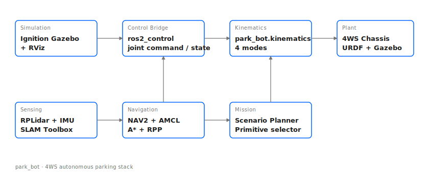

# park_bot

[](https://github.com/nishalangovender/park_bot/actions/workflows/ci.yml)


Autonomous parking of a **four-wheel steering (4WS)** vehicle in ROS2 + Ignition Gazebo.

Started life as my Mechatronics Project 488 final-year thesis at Stellenbosch University under Prof J Engelbrecht (Cum Laude, 2022), and has since been polished into a senior-engineer-shape open-source package: CI, unit tests against a documented kinematic reference, one-shot build and run scripts, and a headless Docker build for reproducibility. The as-submitted thesis snapshot is preserved on the [`thesis`](https://github.com/nishalangovender/park_bot/tree/thesis) branch.

A live TypeScript re-implementation of the kinematics and four showcase scenarios is at **[nishalangovender.com/projects/park-bot/demo](https://nishalangovender.com/projects/park-bot/demo)**.

## Architecture



Stack:

- **Simulation** — Ignition Gazebo (Fortress) driving a URDF 4WS chassis.
- **Control bridge** — `ros2_control` with a position-controlled steering group and a velocity-controlled wheel group.
- **Kinematics** — `park_bot.kinematics` — pure-Python module implementing the four 4WS modes (see `docs/kinematics.md`).
- **Sensing** — RPLidar + IMU, SLAM via [slam_toolbox](https://github.com/SteveMacenski/slam_toolbox).
- **Navigation** — NAV2 with A* global planning and Regulated Pure Pursuit (RPP) following; AMCL on the built map.
- **Mission** — scenario planner that dispatches the right 4WS primitive for each parking manoeuvre.

## Kinematic modes

| Mode | Front wheels | Rear wheels | Body motion |
|------|--------------|-------------|-------------|
| Ackermann | steer | straight | forward with yaw |
| Crab | same direction as rear | same as front | translate along `(vₓ, vᵧ)`, no yaw |
| Counter-steer | steer one way | steer the other way | forward with halved turning radius |
| Pivot | tangent to chassis circle | tangent to chassis circle | rotate in place |

Equations: [`docs/kinematics.md`](docs/kinematics.md). Cross-implementation fixtures: [`docs/kinematic_fixtures.md`](docs/kinematic_fixtures.md).

## Quickstart

### Native (Ubuntu 22.04)

```bash
mkdir -p ~/ros2_ws/src && cd ~/ros2_ws/src
gh repo clone nishalangovender/park_bot
gh repo clone nishalangovender/fws_controller
gh repo clone nishalangovender/rf2o_laser_odometry
cd ~/ros2_ws
src/park_bot/scripts/build.sh
src/park_bot/scripts/run_sim.sh
```

### Docker (headless, reproducible build)

The Dockerfile produces a headless `ros:humble` container with the workspace pre-built. Useful for CI parity and for validating the package descriptor on any machine. **For full GUI simulation (Gazebo + RViz) on macOS, use the native path** — running the GUI inside the container on Apple Silicon needs XQuartz gymnastics that aren't worth the trouble right now.

```bash
docker compose up --build
docker compose exec park_bot bash
# inside container:
ros2 launch park_bot sim.launch.py
```

### Windows

Windows support is a best-effort convenience; ROS2 Humble has full Tier 1 support on Ubuntu 22.04, which is the recommended path.

```cmd
scripts\build.bat
scripts\run_sim.bat
```

## Tests

```bash
python3 -m pytest test/ -v
```

Expect every kinematic case defined in `docs/kinematic_fixtures.md` to pass within `1e-5`.

## Repo map

```
park_bot/
├── .github/workflows/ci.yml   — lint / unit test / colcon build
├── config/                    — robot, NAV2, SLAM, controller YAML
├── description/               — URDF / xacro for the 4WS chassis
├── docs/
│   ├── architecture.svg       — stack block diagram
│   ├── kinematics.md          — 4WS kinematic reference
│   └── kinematic_fixtures.md  — cross-implementation fixture table
├── launch/                    — ROS2 launch files
├── park_bot/
│   ├── __init__.py
│   └── kinematics.py          — pure-Python 4WS module (no ROS imports)
├── scripts/                   — build + run one-shot scripts (sh + bat)
├── test/
│   └── test_kinematics.py     — pytest cases
├── worlds/                    — Ignition worlds
├── Dockerfile
├── docker-compose.yml
├── CONTRIBUTING.md
└── LICENSE
```

## Related repos

- [`fws_controller`](https://github.com/nishalangovender/fws_controller) — ros2_control controller plugin for the 4WS vehicle.
- [`rf2o_laser_odometry`](https://github.com/nishalangovender/rf2o_laser_odometry) — laser-based odometry.

## Acknowledgements

Built on the Robot Package Template by Josh Newans — [Articulated Robotics](https://articulatedrobotics.xyz). Thesis supervision by Prof J Engelbrecht, Stellenbosch University Department of Mechanical and Mechatronic Engineering.

## Licence

MIT — see [`LICENSE`](LICENSE).
